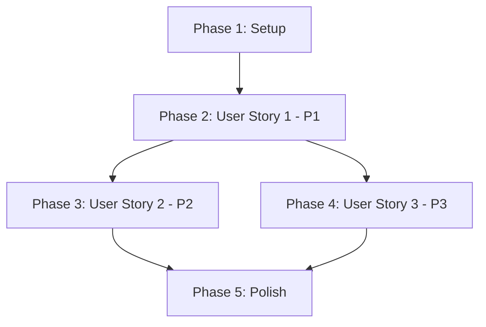

# Implementation Tasks: Reduce Export Redundancy

**Feature**: Reduce Export Redundancy
**Branch**: `001-reduce-export-redundancy`
**Created**: 2025-12-11
**Status**: Ready for Implementation

## Overview

This document breaks down the implementation of the export redundancy optimization into actionable tasks organized by user story. Each user story represents an independently testable increment that delivers value.

**Implementation Strategy**: MVP-first approach. User Story 1 (P1) delivers the core optimization and can be deployed independently. User Stories 2 and 3 (P2, P3) validate backward compatibility and architecture compliance.

**Testing Approach**: Manual testing via Google Apps Script editor (no automated testing framework available per platform constraint).

---

## Phase 1: Setup & Preparation

**Goal**: Prepare development environment and understand current implementation before making changes.

**Tasks**:

- [X] T001 Review current implementation in src/Code.js to understand runExportAll() orchestration
- [X] T002 Review current implementation in src/exportForm.js to understand JSON export logic
- [X] T003 Review current implementation in src/toMarkdown.js to understand Markdown export logic
- [X] T004 Document baseline behavior by running runExportAll() and capturing logs (note API call count)
- [X] T005 Create backup of current implementation for comparison testing

**Completion Criteria**:
- ✅ All three source files reviewed and understood
- ✅ Baseline logs captured showing 2 calls to FormApp.openById() and 2 calls to form.getItems()
- ✅ Backup copy created for regression testing

---

## Phase 2: User Story 1 - Export to Both Formats Efficiently (P1)

**Story Goal**: Optimize `runExportAll()` to fetch form data once and reuse it for both JSON and Markdown exports, reducing API calls by 50%.

**Independent Test Criteria**:
- ✅ Running `runExportAll()` logs show FormApp.openById() called exactly once
- ✅ Running `runExportAll()` logs show form.getItems() called exactly once
- ✅ Both JSON and Markdown files created in Drive with matching timestamps
- ✅ JSON and Markdown files contain identical form data (same title, item count, item titles)

**Tasks**:

### Refactor exportFormToJson() Function

- [X] T006 [P] [US1] Add optional parameters to exportFormToJson() signature in src/exportForm.js: (formId, optionalForm, optionalItems)
- [X] T007 [US1] Implement fallback logic using || operator in src/exportForm.js: form = optionalForm || FormApp.openById(formId)
- [X] T008 [US1] Implement fallback logic using || operator in src/exportForm.js: items = optionalItems || form.getItems()
- [X] T009 [US1] Verify all downstream code in exportFormToJson() uses local variables (form, items) instead of re-fetching

### Refactor exportFormToMarkdown() Function

- [X] T010 [P] [US1] Add optional parameters to exportFormToMarkdown() signature in src/toMarkdown.js: (formId, optionalForm, optionalItems)
- [X] T011 [US1] Implement fallback logic using || operator in src/toMarkdown.js: form = optionalForm || FormApp.openById(formId)
- [X] T012 [US1] Implement fallback logic using || operator in src/toMarkdown.js: items = optionalItems || form.getItems()
- [X] T013 [US1] Verify all downstream code in exportFormToMarkdown() uses local variables (form, items) instead of re-fetching

### Update runExportAll() Orchestration

- [X] T014 [US1] Add shared data-fetching phase at start of runExportAll() in src/Code.js with try-catch error handling
- [X] T015 [US1] Wrap FormApp.openById(FORM_ID) in try-catch and log error if it fails in src/Code.js
- [X] T016 [US1] Add early return after fetch error to prevent both exports from proceeding in src/Code.js
- [X] T017 [US1] Inline JSON export logic from runExportToJSON() into runExportAll() and pass optional parameters (form, items) in src/Code.js
- [X] T018 [US1] Wrap JSON export in independent try-catch to allow Markdown export to proceed if JSON fails in src/Code.js
- [X] T019 [US1] Inline Markdown export logic from runExportToMarkdown() into runExportAll() and pass optional parameters (form, items) in src/Code.js
- [X] T020 [US1] Wrap Markdown export in independent try-catch to allow partial success in src/Code.js

### Manual Testing (User Story 1)

- [ ] T021 [US1] Deploy changes to Apps Script using npm run push
- [ ] T022 [US1] Run runExportAll() in Apps Script editor and verify logs show single FormApp.openById() call
- [ ] T023 [US1] Run runExportAll() in Apps Script editor and verify logs show single form.getItems() call
- [ ] T024 [US1] Verify two files created in Drive folder with matching timestamps
- [ ] T025 [US1] Download both files and verify JSON title matches Markdown title
- [ ] T026 [US1] Download both files and verify JSON item count matches Markdown question count
- [ ] T027 [US1] Test error handling: temporarily set invalid FORM_ID and verify both exports fail gracefully with error logged

**User Story 1 Completion Criteria**:
- ✅ API calls reduced from 4 total (2 openById, 2 getItems) to 2 total (1 openById, 1 getItems)
- ✅ Both export files created successfully with identical form data
- ✅ Error handling works: invalid form ID prevents both exports
- ✅ Logs confirm optimization achieved

---

## Phase 3: User Story 2 - Individual Exports Remain Independent (P2)

**Story Goal**: Verify that individual export functions (`runExportToJSON()`, `runExportToMarkdown()`) continue to work independently with backward compatibility.

**Independent Test Criteria**:
- ✅ Running `runExportToJSON()` alone creates JSON file without errors
- ✅ Running `runExportToMarkdown()` alone creates Markdown file without errors
- ✅ Individual export output format matches pre-optimization baseline
- ✅ Individual exports do NOT benefit from optimization (still make 2 API calls each)

**Tasks**:

### Verify Backward Compatibility

- [X] T028 [P] [US2] Verify runExportToJSON() in src/Code.js still calls exportFormToJson(FORM_ID) with single parameter (no optional params)
- [X] T029 [P] [US2] Verify runExportToMarkdown() in src/Code.js still calls exportFormToMarkdown(FORM_ID) with single parameter (no optional params)
- [X] T030 [US2] Confirm no signature changes to runExportToJSON() or runExportToMarkdown() entry point functions

### Manual Testing (User Story 2)

- [ ] T031 [US2] Deploy changes to Apps Script (if not already deployed from US1)
- [ ] T032 [US2] Run runExportToJSON() alone in Apps Script editor and verify JSON file created
- [ ] T033 [US2] Run runExportToMarkdown() alone in Apps Script editor and verify Markdown file created
- [ ] T034 [US2] Compare individual export output to baseline backup and verify format unchanged
- [ ] T035 [US2] Verify logs for individual exports show fallback fetching (2 API calls each, not optimized)

**User Story 2 Completion Criteria**:
- ✅ Individual exports work independently without errors
- ✅ Output format unchanged from baseline (backward compatible)
- ✅ Fallback logic confirmed working (exports fetch data when optional params not provided)

---

## Phase 4: User Story 3 - Maintain Module Independence (P3)

**Story Goal**: Verify that the optimization preserves the self-contained module architecture with no cross-file dependencies between export modules.

**Independent Test Criteria**:
- ✅ exportForm.js and toMarkdown.js remain separate files
- ✅ No direct imports/requires between exportForm.js and toMarkdown.js
- ✅ Shared orchestration logic exists only in Code.js (neutral location)
- ✅ Constitution Principle V compliance confirmed

**Tasks**:

### Architecture Review

- [X] T036 [P] [US3] Verify src/exportForm.js has no imports or references to toMarkdown.js
- [X] T037 [P] [US3] Verify src/toMarkdown.js has no imports or references to exportForm.js
- [X] T038 [US3] Confirm data sharing happens via explicit parameter passing from Code.js (not via global variables or cross-module calls)
- [X] T039 [US3] Review Constitution Principle V compliance: confirm modules remain self-contained

### Documentation Update

- [X] T040 [US3] Update CLAUDE.md Architecture section to document the parameter-based refactoring pattern
- [X] T041 [US3] Update CLAUDE.md to note the optimization applies only to runExportAll() not individual exports
- [X] T042 [US3] Add comment in src/Code.js above runExportAll() explaining the shared data-fetching optimization

**User Story 3 Completion Criteria**:
- ✅ No cross-module dependencies introduced
- ✅ Architecture remains aligned with Constitution Principle V
- ✅ Documentation updated to reflect optimization pattern

---

## Phase 5: Polish & Final Validation

**Goal**: Complete final testing, documentation, and deployment verification across all user stories.

**Tasks**:

### Comprehensive Testing

- [ ] T043 Test with small form (5 items) and verify both exports complete successfully
- [ ] T044 Test with large form (50+ items) and verify both exports complete successfully and performance improved
- [ ] T045 Test partial failure scenario: modify exportFormToJson to throw error and verify Markdown export still succeeds
- [X] T046 Verify all defensive programming patterns (typeof checks, try-catch) preserved in refactored code

### Code Quality

- [X] T047 Review all three modified files (Code.js, exportForm.js, toMarkdown.js) for code clarity and comments
- [X] T048 Verify no hardcoded IDs introduced (template placeholders {{FORM_ID}} preserved in source files)
- [ ] T049 Run npm run push and verify deployment succeeds without errors
- [X] T050 Verify .gitignore still excludes tmp/dist/ directory (no build artifacts committed)

### Final Documentation

- [ ] T051 Update README.md if needed to reflect performance optimization (optional)
- [X] T052 Create summary of changes for project log or changelog: API call reduction, performance improvement, backward compatibility maintained

**Phase 5 Completion Criteria**:
- ✅ All manual tests pass across all scenarios
- ✅ Code quality review complete
- ✅ Documentation updated
- ✅ Ready for production use

---

## Dependencies & Execution Order

### User Story Dependencies



**Dependency Rules**:

1. **Setup → User Story 1**: Must understand baseline before implementing optimization
2. **User Story 1 → User Story 2**: Must implement optimization before testing backward compatibility
3. **User Story 1 → User Story 3**: Must implement optimization before verifying architecture compliance
4. **User Stories 2 & 3 → Polish**: Must complete all stories before final validation

**Parallel Opportunities**:

- **Within User Story 1**:
  - T006-T009 (exportFormToJson refactor) can run in parallel with T010-T013 (exportFormToMarkdown refactor)
  - T022 and T023 can be done simultaneously (single test run captures both metrics)

- **User Story 2 & 3**:
  - Can be executed in parallel after User Story 1 complete
  - T028-T029-T030 (US2) independent from T036-T037-T038 (US3)

---

## Parallel Execution Examples

### Example 1: Refactoring Both Export Functions Simultaneously

Tasks T006-T009 and T010-T013 are fully parallelizable:

```bash
# Developer A: Refactor exportFormToJson
T006: Add parameters to exportFormToJson signature
T007: Implement fallback for form
T008: Implement fallback for items
T009: Verify local variable usage

# Developer B: Refactor exportFormToMarkdown (parallel)
T010: Add parameters to exportFormToMarkdown signature
T011: Implement fallback for form
T012: Implement fallback for items
T013: Verify local variable usage
```

**Merge Point**: T014 (Update runExportAll orchestration) requires both export functions refactored.

### Example 2: Testing User Story 2 & 3 in Parallel

After User Story 1 complete:

```bash
# Tester A: User Story 2 validation
T028-T035: Test individual export backward compatibility

# Tester B: User Story 3 validation (parallel)
T036-T042: Verify architecture compliance and update docs
```

**Merge Point**: T043 (Phase 5 comprehensive testing) requires both stories validated.

---

## Task Summary

**Total Tasks**: 52

**Tasks by Phase**:
- Phase 1 (Setup): 5 tasks
- Phase 2 (User Story 1 - P1): 22 tasks
- Phase 3 (User Story 2 - P2): 8 tasks
- Phase 4 (User Story 3 - P3): 7 tasks
- Phase 5 (Polish): 10 tasks

**Tasks by User Story**:
- User Story 1 (Export Optimization): 22 tasks
- User Story 2 (Backward Compatibility): 8 tasks
- User Story 3 (Architecture Compliance): 7 tasks

**Parallelizable Tasks**: 12 tasks marked [P]

**Estimated Timeline** (single developer, sequential):
- Phase 1: 1 hour (review and setup)
- Phase 2: 3-4 hours (core refactoring and testing)
- Phase 3: 1 hour (backward compatibility validation)
- Phase 4: 1 hour (architecture review and docs)
- Phase 5: 1-2 hours (final testing and polish)
- **Total**: 7-9 hours

**Estimated Timeline** (parallel execution):
- Phase 1: 1 hour
- Phase 2: 2-3 hours (refactor both export functions in parallel)
- Phase 3 & 4: 1 hour (validate US2 and US3 in parallel)
- Phase 5: 1-2 hours
- **Total**: 5-7 hours

---

## MVP Scope Recommendation

**Minimum Viable Product**: Phase 2 (User Story 1) only

**Rationale**:
- Delivers core optimization value (50% API call reduction)
- Fully testable independently
- Provides measurable performance improvement
- Can be deployed and validated in production

**Post-MVP**:
- Phase 3 (US2) validates backward compatibility - important for confidence but not blocking deployment
- Phase 4 (US3) validates architecture - ensures maintainability but doesn't affect functionality
- Phase 5 (Polish) adds robustness and documentation

**Recommended Approach**: Implement and deploy US1, then add US2/US3/Polish in subsequent iteration after production validation.

---

## Implementation Strategy

### Step-by-Step Approach

1. **Start with Setup (Phase 1)**: Understand current implementation thoroughly
2. **Implement MVP (Phase 2 - User Story 1)**: Core optimization with full testing
3. **Deploy to Apps Script**: Push and validate in actual runtime environment
4. **Validate MVP**: Run all US1 tests and confirm success criteria met
5. **Add Validation Stories (Phase 3 & 4)**: Confirm backward compatibility and architecture
6. **Polish (Phase 5)**: Final testing, edge cases, documentation

### Key Success Metrics

After completing all phases:

- ✅ **Performance**: API calls reduced by 50% (4 → 2) for runExportAll()
- ✅ **Correctness**: Both exports produce identical, valid output
- ✅ **Compatibility**: Individual exports work unchanged
- ✅ **Architecture**: No cross-module dependencies introduced
- ✅ **Quality**: All defensive patterns preserved, code documented

---

## Risk Mitigation

### Risk 1: Refactoring breaks existing functionality

**Mitigation**:
- T005: Create backup before changes
- T034: Compare output to baseline
- User Story 2 dedicated to backward compatibility validation

### Risk 2: Apps Script API behavior differs from expected

**Mitigation**:
- T004: Document baseline behavior
- T022-T027: Comprehensive manual testing in actual Apps Script environment
- T043-T045: Edge case testing with various form sizes

### Risk 3: Performance optimization not realized

**Mitigation**:
- T022-T023: Explicit log verification of API call reduction
- T004: Baseline captured for comparison
- T044: Test with large form to measure real improvement

---

## Questions & Clarifications

If you encounter issues during implementation:

1. **Refactoring questions**: See [research.md](research.md) for design decisions
2. **API contract questions**: See [contracts/api.md](contracts/api.md) for function signatures
3. **Testing guidance**: See [quickstart.md](quickstart.md) for detailed test scenarios
4. **Architecture questions**: See [plan.md](plan.md) Constitution Check section

---

## Next Steps

1. **Review this task breakdown** and confirm understanding
2. **Start with Phase 1 (Setup)** - tasks T001-T005
3. **Proceed to Phase 2 (User Story 1)** - the core optimization
4. **Test thoroughly** after each phase before proceeding to next
5. **Deploy to Apps Script** early and often to catch platform-specific issues

**Ready to begin!** 🚀
